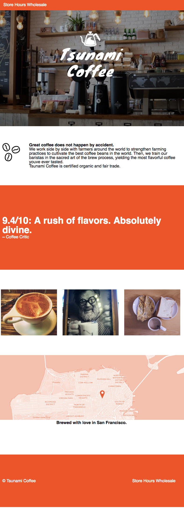
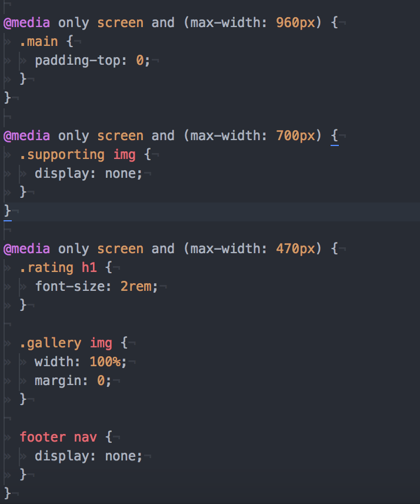

# Learn Responsive Design

### Tsunami Coffee

The purpose of this site is to use proper Responsive Design to make it
resizable and efficient.

### Launching this project

Simply clone this repo and open **index.html**

```
cd ~/Desktop &&
git clone https://github.com/amnotme/JSPractice2.git &&
cd JSPractice2 &&
open index.html
```
## Site **without** responsive design

;

## Site **with** responsive design

;

## Media queries in action

;
